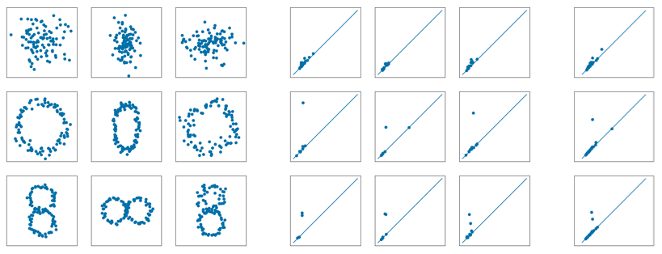
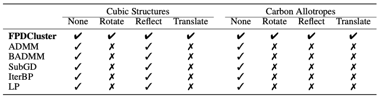

# Fuzzy c-Means Clustering for Persistence Diagrams

This repository is the official implementation of the paper [Fuzzy c-Means Clustering for Persistence Diagrams](https://arxiv.org/abs/2006.02796). 

We develop an algorithm to fuzzy cluster datasets based on their topology. In the figure we show nine datasets with their corresponding persistence diagrams, and three cluster centres produced by our algorithm. The cluster centres have zero, one, or two significant off-diagonal points, corresponding to zero, one, or two rings in the original datasets.




## Requirements

To install requirements:

```setup
pip install -r requirements.txt
```

## Running the Algorithm

In ```clustering.py``` we provide a function ```fpd_cluster``` that accepts a list of datasets and number of clusters as an input, and returns membership values and cluster centres.
To use it, have ```clustering.py``` in the same folder as your project and ```import fpd_cluster from clustering``` at the top of your file.

If you already have a list of persistence diagrams, you can cluster them using the ```pd_fuzzy``` function in ```clustering.py```.

## Results

Our algorithm is able to successfully cluster cubic structures and carbon allotropes from atomic coordinates, regardless of transformations applied to the data.
Comparable Wasserstein barycentre clustering algorithms fail to cluster all transformed carbon allotropes datasets, and all but the reflected cubic structures datasets.



Our algorithm also runs at least an order of magnitude faster than comparable Wasserstein barycentre clustering algorithms. The table below shows timing results in seconds per iteration.

| Points         |     100     |     200    |     300    |    400    |    500    |    600    |    700    |    800    |    900    |    1000   |
|----------------|:-----------:|:----------:|:----------:|:---------:|:---------:|:---------:|:---------:|:---------:|:---------:|:---------:|
| **FPDCluster** | **0.01552** | **0.1975** | **0.9358** | **2.229** | **5.694** | **12.29** | **19.27** | **34.50** | **53.20** | **77.81** |
| ADMM           |    5.622    |    34.86   |    161.3   |   617.6   |     -     |     -     |     -     |     -     |     -     |     -     |
| BADMM          |    0.2020   |    2.188   |    26.38   |   112.6   |     -     |     -     |     -     |     -     |     -     |     -     |
| SubGD          |    0.4217   |    2.273   |    22.17   |   103.4   |     -     |     -     |     -     |     -     |     -     |     -     |
| IterBP         |    0.3825   |    2.226   |    21.57   |   108.9   |     -     |     -     |     -     |     -     |     -     |     -     |
| LP             |    0.3922   |    2.031   |    22.32   |   117.3   |     -     |     -     |     -     |     -     |     -     |     -     |

## Reproducibility

### FPDCluster

To reproduce the synthetic data results and figures:
```
python src/synthetic_data.py
```

To reproduce the timing results:
```
python src/timing_experiments.py
```

To reproduce the cubic structures and carbon allotropes results:
```
python src/lattice_structures.py
```

N.b. The paths to the data require that you are in the root directory when running these commands.

### Other algorithms

The remaining Wasserstein barycentre clustering algorithms use implementations from [this](https://github.com/bobye/WBC_Matlab) repository. We provide a copy of this library in ```src/WBC_Matlab```.
We have changed settings to suit our data, but the implementations of the algorithms themselves are untouched. 

To reproduce our results, you can select the experiment and dataset by uncommenting the file and relevant settings in ```d2_clustering.m```. To change the algorithm, uncomment the required algorithm from line 119 in ```d2clusters.m```.
Having selected the experiment and algorithm in this way, run ```d2_clustering.m``` to compute the cluster labels and display the time taken.


## Datasets

We provide examples of face-centred and body-centred cubic structures from the [Materials Project](https://materialsproject.org/), and diamond and cis-hinged polydiacetylene from the [SACADA Carbon Allotrope Database](http://sacada.sctms.ru/). 
These are provided as ```cif``` files, which we export to ```xyz``` format using [VESTA](https://jp-minerals.org/vesta/), then convert to ```csv``` using a custom function in ```file_utils.py```.

The Wasserstein barycentre code that we have used has a custom ```d2``` file format. Also included in ```file_utils.py``` is a function ```save_as_d2``` that saves the data structures used in our code to d2 format.


## Licensing

All content in this repository is licensed under the MIT license.